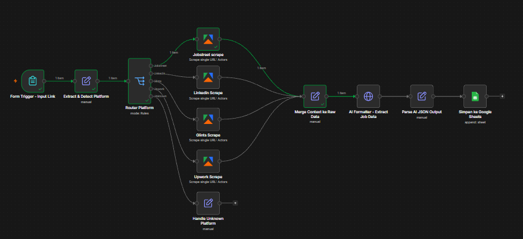

  

<h3 align="center">AI Job Scraper Automation Workflow</h3>

  

    Otomasi ekstraksi data lowongan kerja dari multi-platform (Jobstreet, LinkedIn, Glints, Upwork) berbasis n8n, Apify Scraper, dan Gemini AI dan disimpan di Google Sheet.
  

  
Daftar Isi

  <ol>
    <li>
      <a href="#tentang-proyek">Tentang Proyek</a>
      <ul>
        <li><a href="#teknologi-yang-digunakan">Teknologi yang Digunakan</a></li>
      </ul>
    </li>
    <li>
      <a href="#konfigurasi-pemetaan-data">Konfigurasi Pemetaan Data</a>
    </li>
    <li>
      <a href="#memulai-langkah-awal">Memulai Langkah Awal</a>
      <ul>
        <li><a href="#prasyarat">Prasyarat</a></li>
        <li><a href="#langkah-instalasi">Langkah Instalasi</a></li>
      </ul>
    </li>
    <li><a href="#penggunaan">Penggunaan</a></li>
    <li><a href="#kontribusi">Kontribusi</a></li>
    <li><a href="#lisensi">Lisensi</a></li>
    <li><a href="#kontak">Kontak</a></li>
  </ol>

## Tentang Proyek

Proyek ini menyediakan berkas blueprint workflow **n8n** yang dirancang untuk mempercepat proses pengumpulan informasi lowongan pekerjaan secara mandiri (*job hunting tracking*). Pengguna cukup memasukkan satu URL lowongan melalui Form n8n, kemudian sistem secara cerdas akan mendeteksi platform asal, melakukan *scraping* konten mentah, merapikan data menggunakan AI, dan menyimpannya langsung ke Google Sheets.

**Fitur Utama:**
* **Multi-Platform Router:** Mendeteksi secara dinamis apakah URL berasal dari Jobstreet, LinkedIn, Glints, atau Upwork.
* **Resilient Web Scraping:** Memanfaatkan integrasi aktor Apify untuk menembus proteksi bot pada platform lowongan kerja.
* **Intelligent AI Extraction:** Memakai Google Gemini 2.5 Flash Lite untuk menyaring *raw HTML/Markdown* menjadi entitas JSON yang bersih tanpa *noise*.
* **Structured Storage:** Menyimpan riwayat data lowongan secara terorganisir ke kolom Google Sheets yang telah ditentukan.

(<a href="#readme-top">kembali ke atas</a>)

### Teknologi yang Digunakan

* [![n8n][n8n-shield]][n8n-url]
* [![Google Gemini][Gemini-shield]][Gemini-url]
* [![Apify][Apify-shield]][Apify-url]
* [![Google Sheets][GoogleSheets-shield]][GoogleSheets-url]

## Konfigurasi Pemetaan Data
| Nama Kolom Google Sheets | Properti JSON Target (Gemini) | Deskripsi / Contoh Isian |
| :--- | :--- | :--- |
| **Posisi** | `Posisi` | Judul jabatan lowongan (misal: *Back End Developer*) |
| **Perusahaan** | `Perusahaan` | Nama Instansi, PT, atau perusahaan pembuka lowongan |
| **Requirements** | `Requirements` | Kualifikasi teknis, jenjang pendidikan, dan pengalaman kerja |
| **Jobdesk** | `Jobdesk` | Deskripsi tugas (opsional) |
| **Lokasi** | `Lokasi` | Lokasi penempatan kerja (misal: *Jakarta Raya*, *Remote*) |
| **Jam_Kerja** | `Jam_Kerja` | Karakteristik kerja (misal: *Hybrid*, *Full-time*, *Contract*) |
| **Waktu_Post** | `Waktu_Post` | Kapan lowongan tersebut dibuat/ditayangkan oleh platform |
| **link** | *link job* | Tautan URL lowongan

### Prasyarat

Sebelum mengimpor berkas konfigurasi, pastikan Anda telah memiliki akun dan kredensial API dari beberapa layanan di bawah ini:
* **n8n**
* **Apify API Token**
* **Google Gemini API Key**
* **Google Sheet Key**

### Langkah Instalasi

1. Unduh berkas konfigurasi workflow **`Job Scraper.json`** yang ada di dalam repositori ini.
2. Buka *dashboard* editor n8n Anda.
3. Buat alur kerja baru (*Create new workflow*).
4. Klik ikon opsi di pojok kanan atas, lalu pilih **Import from File** (atau tekan kombinasi tombol `Ctrl + V` jika menyalin raw teks JSON).
5. Konfigurasikan Environment Variables

## Penggunaan

1. Aktifkan workflow dengan menekan tombol toggle **Active** di pojok kanan atas n8n.
2. Buka tautan produksi dari **Form Trigger** yang disediakan oleh n8n.
3. Masukkan tautan URL lowongan kerja pada kolom form input yang tersedia, lalu klik **Submit**.
4. Data masuk Google Sheet

[n8n-shield]: https://img.shields.io/badge/n8n-FF6C37?style=for-the-badge&logo=n8n&logoColor=white
[n8n-url]: https://n8n.io/
[Gemini-shield]: https://img.shields.io/badge/Google_Gemini-4285F4?style=for-the-badge&logo=googlegemini&logoColor=white
[Gemini-url]: https://ai.google.dev/
[Apify-shield]: https://img.shields.io/badge/Apify-02edb3?style=for-the-badge&logo=apify&logoColor=black
[Apify-url]: https://apify.com/
[GoogleSheets-shield]: https://img.shields.io/badge/Google_Sheets-34A853?style=for-the-badge&logo=googlesheets&logoColor=white
[GoogleSheets-url]: https://www.google.com/sheets/